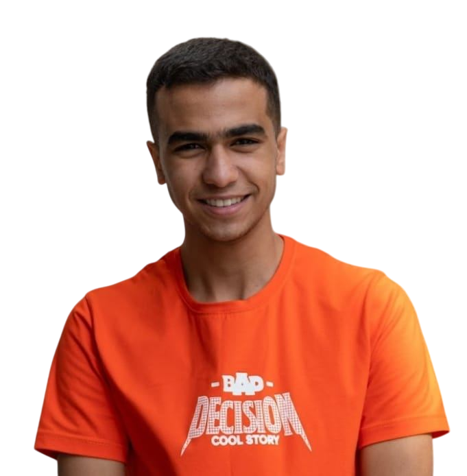
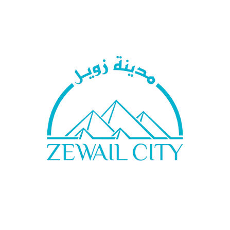
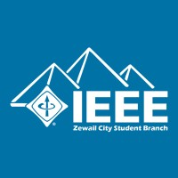
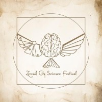
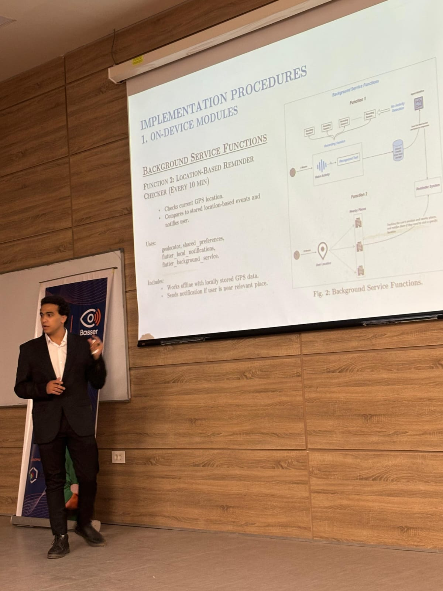
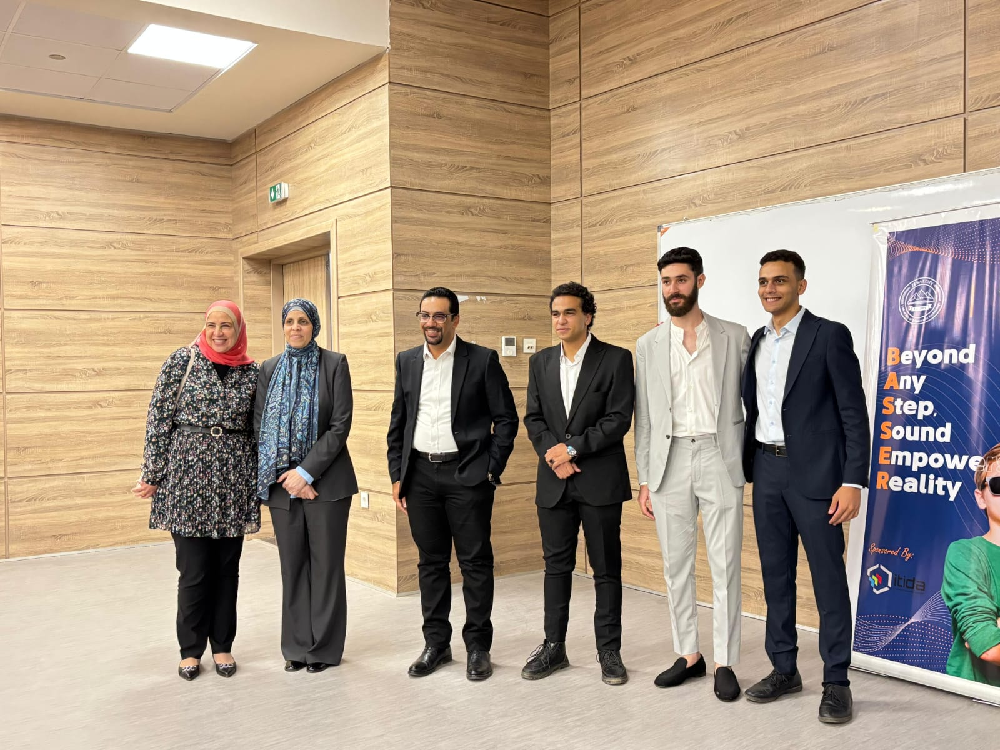
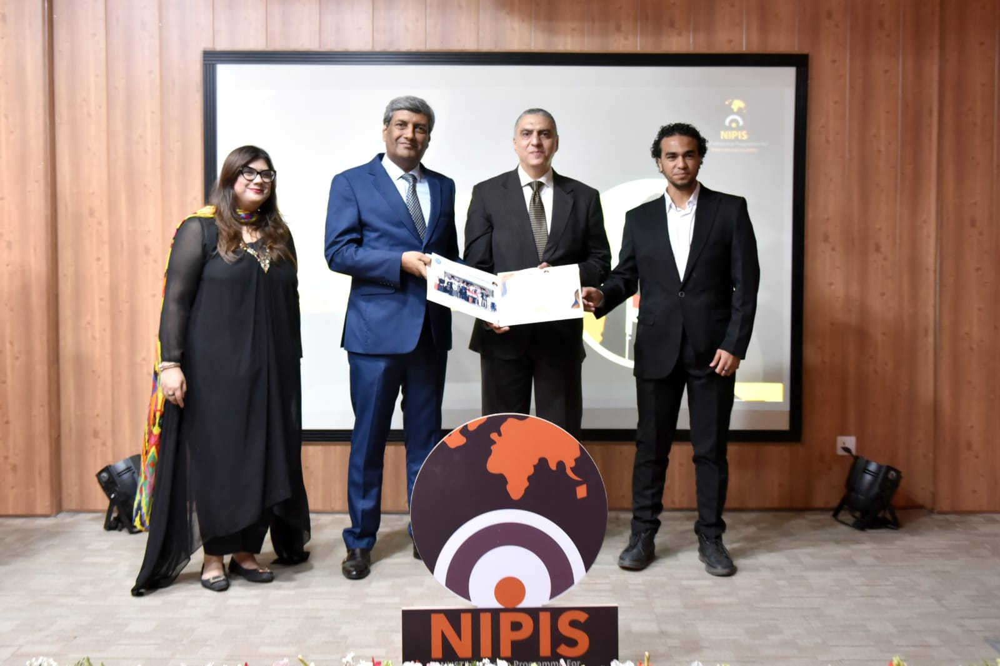
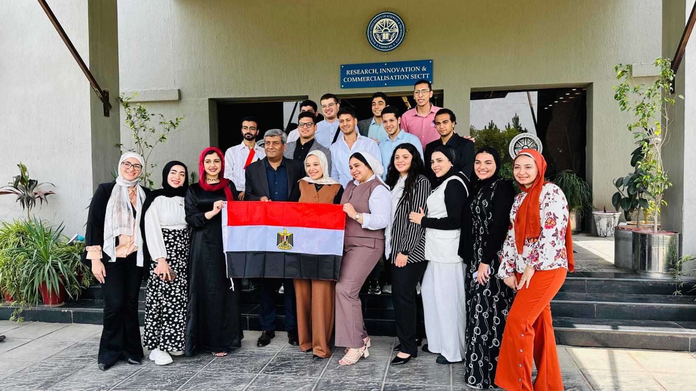
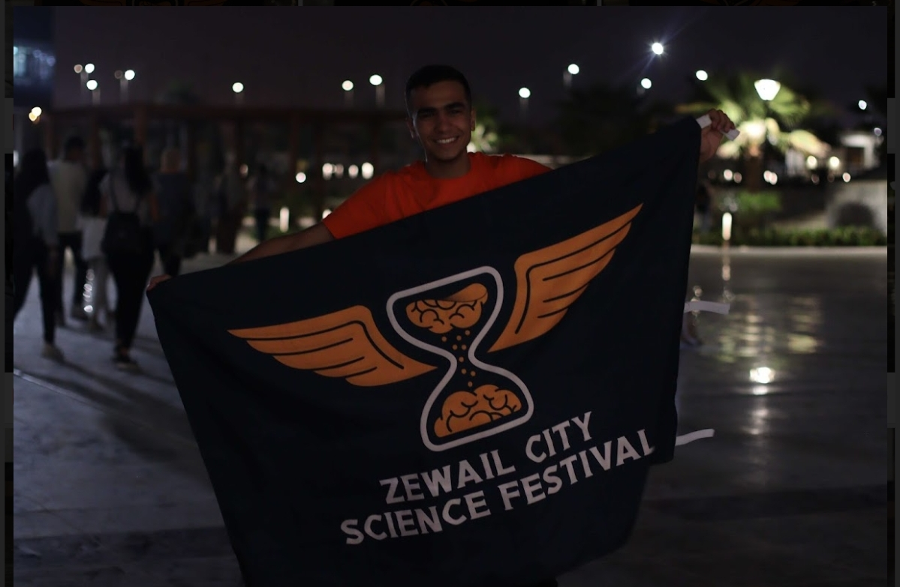
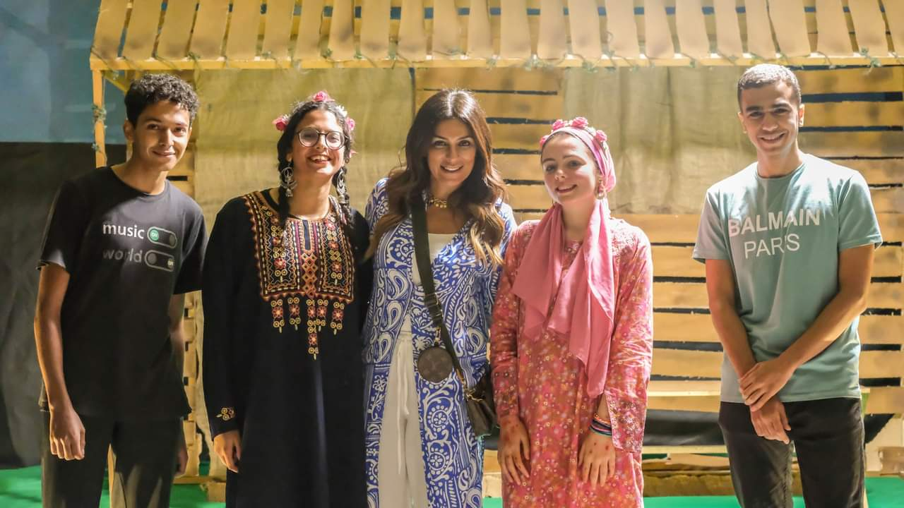

<table>
  <tr>
    <td width="28%" align="center">
      
    </td>
    <td width="72%" align="left">
      <h1>Youssef Alaa Abou-Almagd</h1>
      <h3>Communication & Information Engineer</h3>

      

        
        &nbsp;
        
      

      

        
        &nbsp;
        
      

      
<i>Click a role above to view the corresponding CV.</i>

      

        
        &nbsp;
        
        &nbsp;
        
      

    </td>
  </tr>
</table>

---

# 👨‍💻 Who Am I?

<table>
  <tr>
    <td width="82%" valign="top">
      <h3>🎓 Education & Academic Achievement</h3>
      

        I graduated with a <b>B.Sc. in Communication and Information Engineering</b> from the 
        <b>University of Science and Technology in Zewail City</b>, with a <b>3.80/4.00 GPA</b> and 
        <b>Magna Cum Laude honors</b>. I am also working as a <b>Part-Time Teaching Assistant</b> for 
        <b>Introduction to Computer Science (Python)</b>, supporting undergraduate students in Python programming, 
        problem solving, algorithmic thinking, and debugging.
      

    </td>
    <td width="18%" align="right" valign="top">
      
    </td>
  </tr>
</table>

<h3>💻 Software Development Experience</h3>

  I have <b>2+ years of software development experience</b>, working on real-world software applications and 
  engineering problems. My experience includes building <b>full-stack web applications, backend APIs, 
  database-integrated systems, authentication and authorization workflows, real-time applications, and 
  AI-enabled software systems</b> using modern software engineering tools, frameworks, APIs, and databases.

<h3>🔬 Research Experience</h3>

<table>
  <tr>
    <td width="82%" valign="top">
      <h4>🇵🇰 Research Internship Program — NUST, Pakistan</h4>
      

        I completed a <b>research internship program</b> at the 
        <b>National University of Sciences and Technology (NUST), Islamabad, Pakistan</b>, where I worked in 
        <b>AI/ML for wireless communications</b>. My work focused on multitask deep learning for real-time optimization 
        of rotating-polarization BPSK/QPSK communication links under realistic channel, latency, and computational constraints.
      

    </td>
    <td width="18%" align="right" valign="top">
      
    </td>
  </tr>
</table>

<table>
  <tr>
    <td width="82%" valign="top">
      <h4>📡 Research Assistant — Zewail City</h4>
      

        I worked as a <b>Research Assistant</b> in wireless communications, RF modeling, and deep learning. 
        The project focused on indoor RF power-map generation using <b>3D modeling and ray tracing</b>, and I contributed 
        to applying <b>U-Net deep learning models</b> for fast indoor RF coverage prediction.
      

    </td>
    <td width="18%" align="right" valign="top">
      
    </td>
  </tr>
</table>

<h3>🌐 Industries & Technical Domains</h3>

  My work and interests span the intersection of communications engineering, AI/ML, data-driven problem solving, 
  and software engineering.

  
  &nbsp;
  

  
  &nbsp;
  

---

# 🛠️ Technologies & Tools

## 💻 Programming Languages

  &nbsp;
  &nbsp;
  &nbsp;
  &nbsp;
  &nbsp;
  &nbsp;
  

## 🎨 Frontend Development

  &nbsp;
  &nbsp;
  &nbsp;
  &nbsp;
  &nbsp;
  &nbsp;
  &nbsp;
  

## 📊 Data Visualization

  &nbsp;
  

## ⚙️ Backend Development & APIs

  &nbsp;
  &nbsp;
  &nbsp;
  &nbsp;
  &nbsp;
  

## 📱 Mobile Development

  &nbsp;
  

## 🤖 Machine Learning, Deep Learning & Data

  &nbsp;
  &nbsp;
  &nbsp;
  &nbsp;
  &nbsp;
  &nbsp;
  &nbsp;
  &nbsp;
  &nbsp;
  &nbsp;
  &nbsp;
  

## 📡 Wireless Communications & Signal Processing

  &nbsp;
  

## 🗄️ Databases & Storage

  &nbsp;
  &nbsp;
  &nbsp;
  &nbsp;
  &nbsp;
  &nbsp;
  

## ☁️ Cloud, DevOps & Development Tools

  &nbsp;
  &nbsp;
  &nbsp;
  &nbsp;
  

## 🎨 Design

  

---

# 🌟 Activities & Community Involvement

<table>
  <tr>
    <td width="82%" valign="top">
      <h3>IEEE Zewail City Club</h3>
      

        I participated in the <b>IEEE Zewail City Club</b>, where I contributed to designing and conducting 
        scientific experiments that illustrate important scientific concepts across different fields. This experience 
        strengthened my ability to communicate technical and scientific ideas through practical demonstrations.
      

    </td>
    <td width="18%" align="right" valign="top">
      
    </td>
  </tr>
</table>

<table>
  <tr>
    <td width="82%" valign="top">
      <h3>Zewail City Science Festival 2022</h3>
      

        I participated in the <b>Zewail City Science Festival 2022</b> as a content creator and actor in scientific 
        mini-plays. Through this activity, I helped communicate scientific concepts in an engaging and accessible way 
        for festival audiences.
      

    </td>
    <td width="18%" align="right" valign="top">
      
    </td>
  </tr>
</table>

---

# 📸 Gallery

## 🎓 Graduation

  
  &nbsp;
  
  &nbsp;
  

<i>B.Sc. in Communication and Information Engineering — Magna Cum Laude</i>

## 🇵🇰 NUST Research Internship — Pakistan

  
  &nbsp;
  
  &nbsp;
  

<i>Research Internship Program — National University of Sciences and Technology, Islamabad, Pakistan</i>

## 🔬 Zewail City Science Festival

  
  &nbsp;
  
  &nbsp;
  

<i>Zewail City Science Festival — Science Communication, Content Creation & Performance</i>

---

<b>Building intelligent systems at the intersection of communications, AI, data, and software.</b>

  
  &nbsp;
  
  &nbsp;
  

